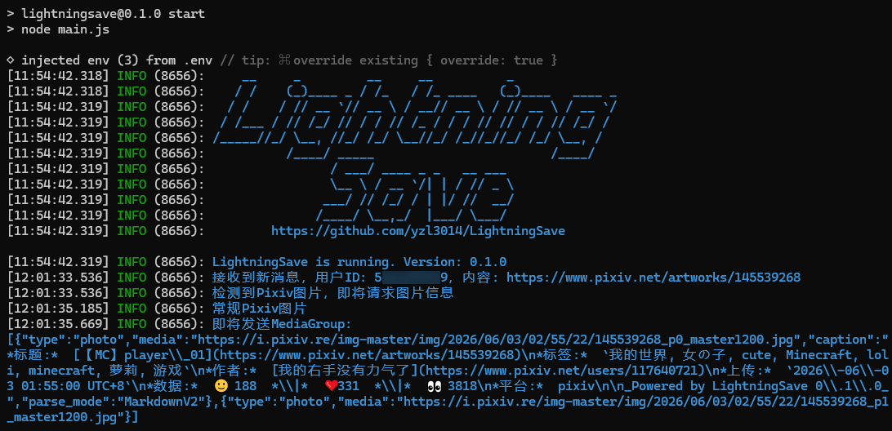
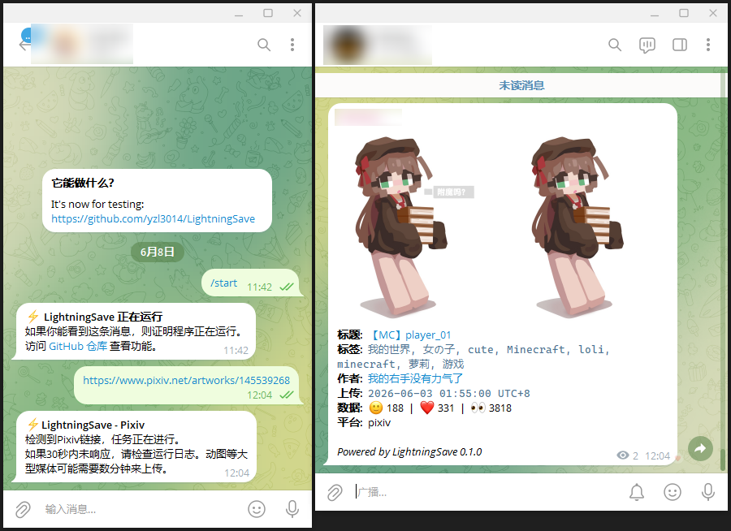
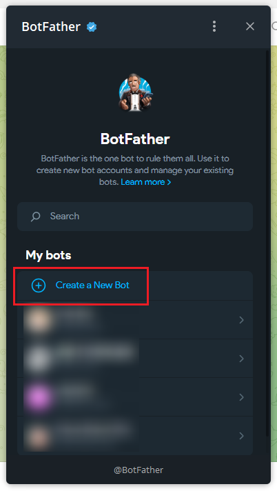
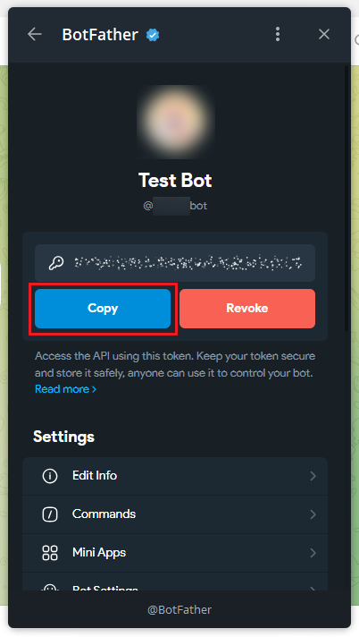
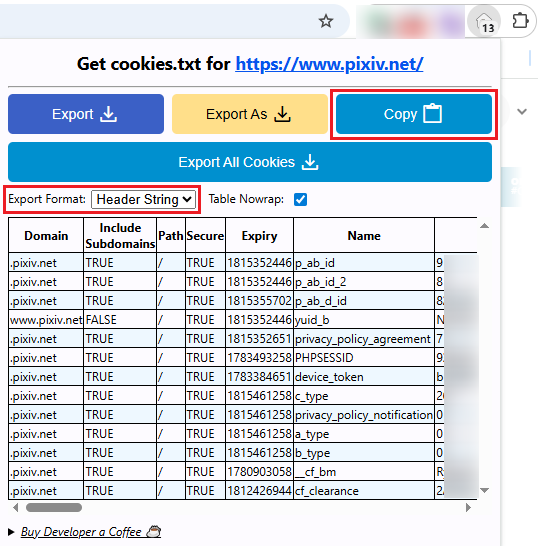

<h1 align="center">
<br />
LightningSave
</h1>

<p align="center">快速保存在线图片到Telegram频道。<br /></p>

## 预览

|命令行|Telegram|
| --- | ------ |
|  |  |

图片中的作品：https://www.pixiv.net/artworks/145539268

## 特点

本项目为了保存 Pixiv 图片而设计。用户给 Telegram Bot 发送一个链接，Bot 能够自动提取有效信息、下载和处理图片、将图片发送至指定 Telegram 频道。

图片下载接口由 [pixiv.cat](https://pixiv.cat/) 提供。

当前受支持的平台：
- Pixiv: `https://www.pixiv.net/artworks/{id}` 支持单张、多张图片和 Ugoira 动图。


## 使用

> [!NOTE]
> 本项目正处于Beta测试阶段（版本号为`0.x.x`）。如发生故障请发布至[issues](/issues)。

### 1. 准备工作

> [!IMPORTANT]  
> 请确保运行程序的设备能够正常访问下列网址：
> - api.telegram.org
> - pixiv.net
> - i.pixiv.re

若在 Windows 命令行上运行（CMD 或 PowerShell），且设备位于中国大陆，请开启代理软件（例如Clash系列）的 **“虚拟网卡模式”** （或叫做 **“TUN模式”**）。

对于上述情况，在运行本项目前，请先运行`chcp 65001`来切换编码。

提前安装 [Git](https://git-scm.com/) 和 [NodeJS](https://nodejs.org/zh-cn/download)，相关教程请自行搜索。

### 2. 安装

找到一个合适的文件夹，从GitHub获取本项目：
```bash
git clone https://github.com/yzl3014/LightningSave.git
```

打开`LightningSave`文件夹，然后用NPM来安装依赖：
```bash
cd LightningSave
npm install
```

### 3. 环境变量

等待依赖安装完毕后，根据下方要求修改`.env.example`，并将其重命名为`.env`。等号后面的值要加双引号。

```text
BotToken="{Telegram Bot的Token}"
ChannelId="{图片将发送至此频道}"
Cookies="{当前版本仅需Pixiv.net的cookie}"
```

`BotToken`：在 Telegram 中搜索 [BotFather](https://t.me/BotFather)，点击“打开”，跟随页面提示来创建Bot。然后点击“Copy”复制Token。

|  |  |
| -- | -- |


`ChannelId`：所有图片都将发送至此频道，但报错信息会通过私信发送。使用 [userinfobot](https://t.me/userinfobot) 获取频道ID。


`Cookies`：在Chrome浏览器中安装 [Get cookies.txt LOCALLY](https://chromewebstore.google.com/detail/cclelndahbckbenkjhflpdbgdldlbecc) 扩展。打开 [Pixiv](https://www.pixiv.net/) ，登录账号。

随后点击浏览器右上角的扩展图标。首先将`Export Format`改为`Header String`，然后点击`Copy`复制，如下图。

安全起见，不要将这段文本放在公开场合。

||
| -- |

### 4. 持久化运行

可以使用[PM2](https://pm2.keymetrics.io/docs/usage/quick-start/)来持久化运行。即便关闭命令行窗口或SSH会话，Bot 依然在线。

```shell
npm install -g pm2
pm2 start main.js --name "LightningSave"
```

## License

[AGPL-3.0](./LICENSE)